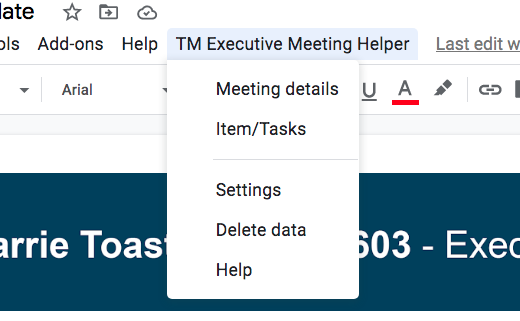
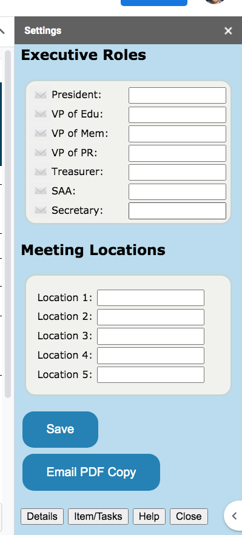
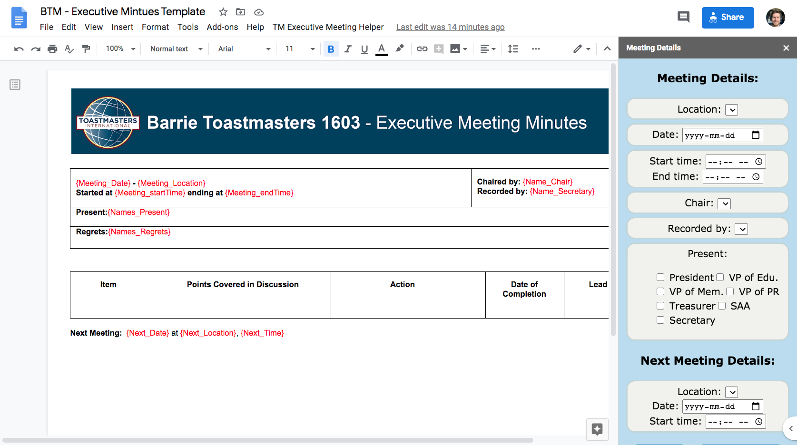
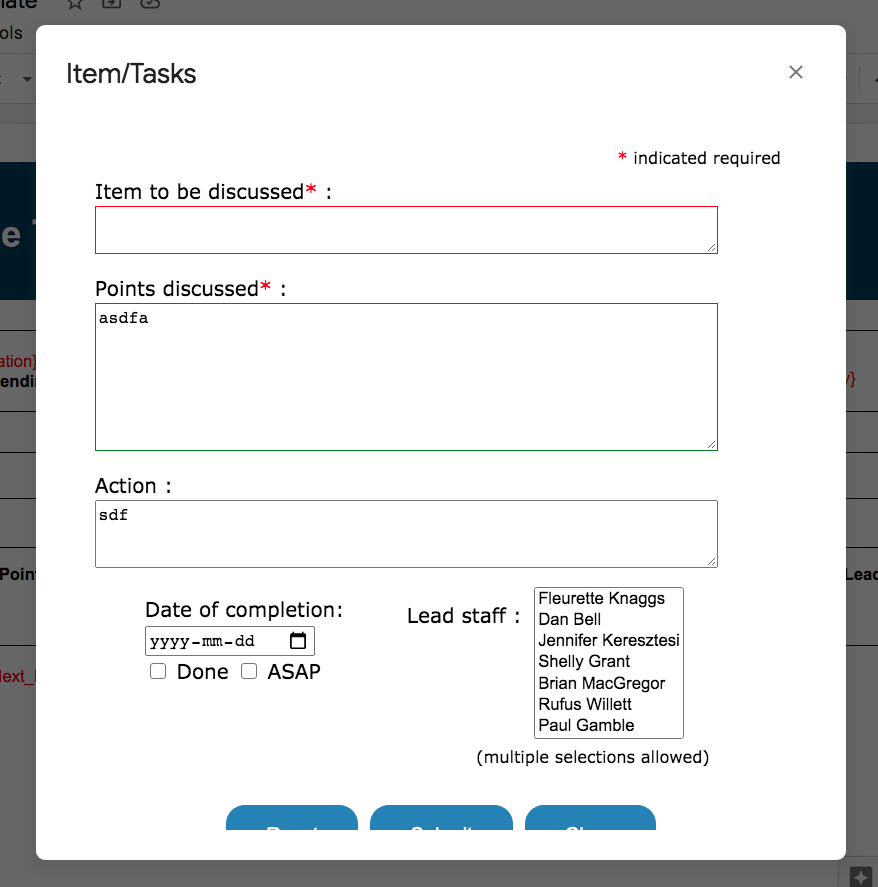

# Toastmasters Executive Meeting Helper

This Google Action Script is to help with Executive Meeting minutes.

Document Template (make a copy to edit): https://docs.google.com/document/d/16Il-GKXOhV22qYZUgSYS-dNxxFtVsNWtKHbNOdwXP-4

## Added Menu 
The added dropdown menu to display different options in the sidebar (right-side of screen).
  
  

## Meeting Details and Settings
You can set the names of the club's executive and the different locations the meeting may take place, which will populate dropdown boxes and other options. For the **Details** sidebar, meeting details can be specified and replace the documents `{placeholders}` quickly. E.g. Meeting date, time, who was present, location, next meeting's location, date and time.

The settings and all data are saved between sessions, unless the **Delete Data** is selected in the dropdown menu will clear out all saved properties and data.

    

## Item/Details Dialog

The main function for the **TM Executive Meeting Helper** is the _Item/Tasks_ dialog. Here quick entries are added to the document-template's table. The interface is design to validate and reset fields quickly to catching **Items**, **Points discuessed,** and any follow up **Action**, **Completion Date**, and the **Lead staff** it will be assigned to.

